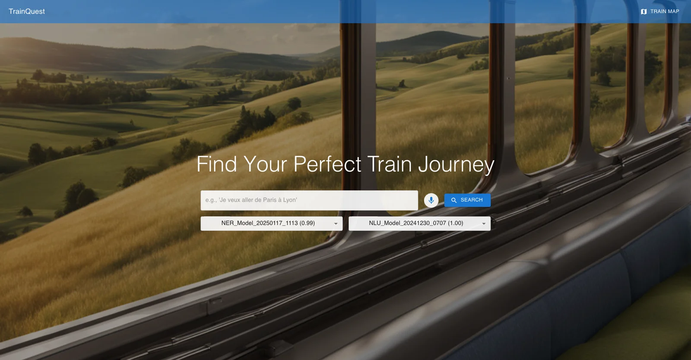
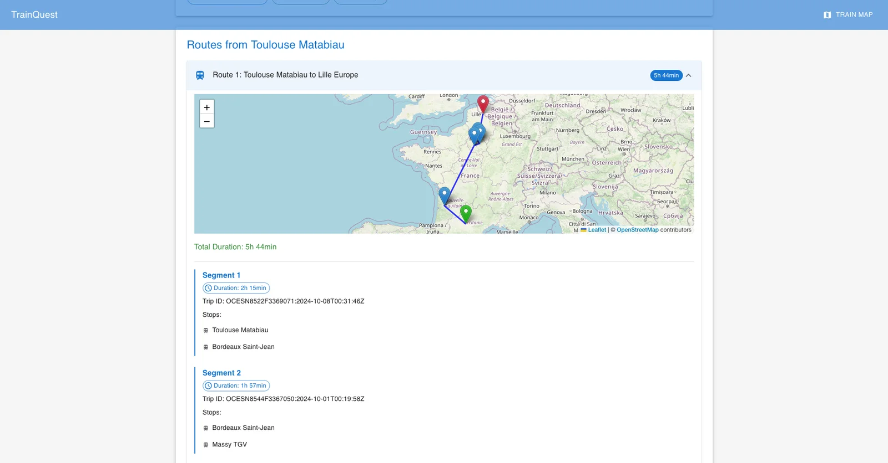
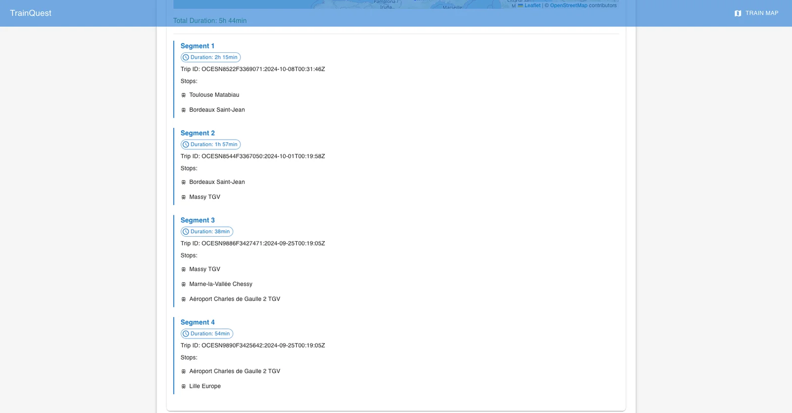
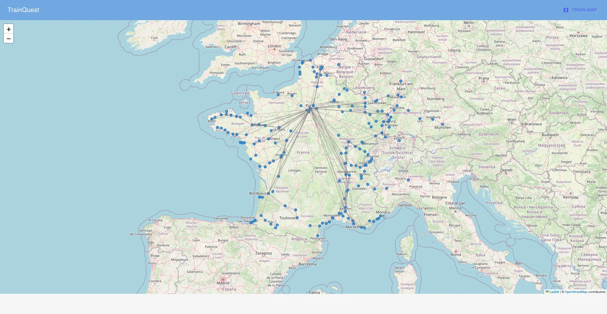
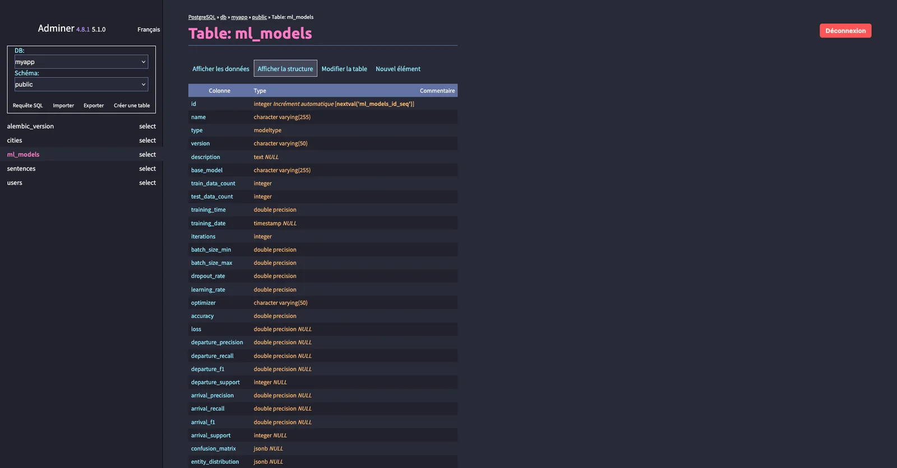
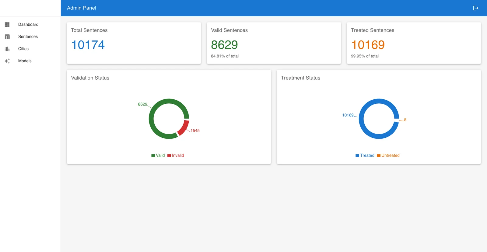
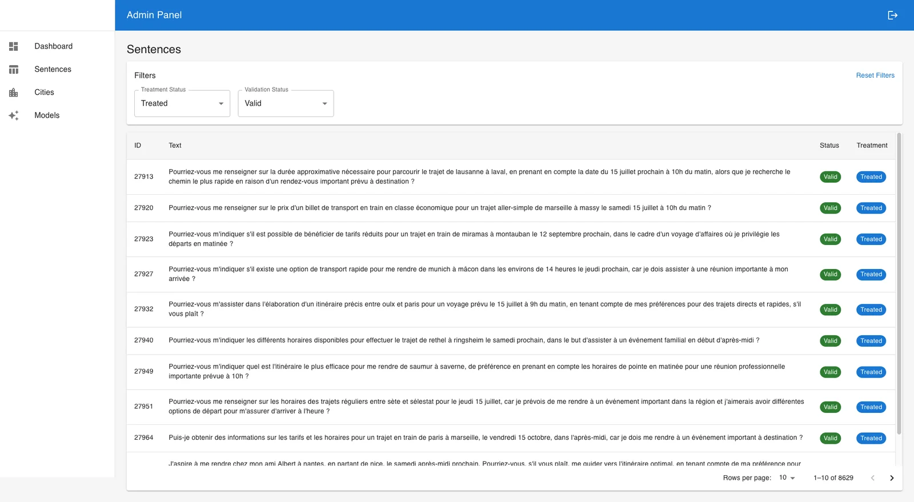
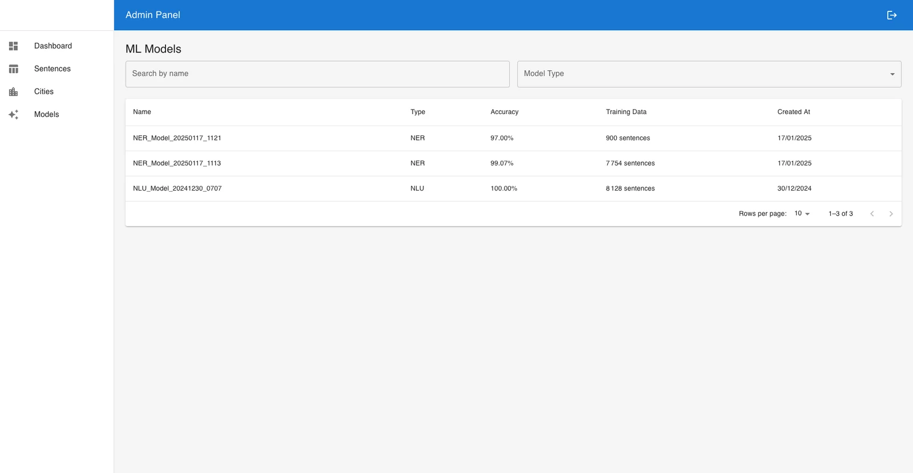
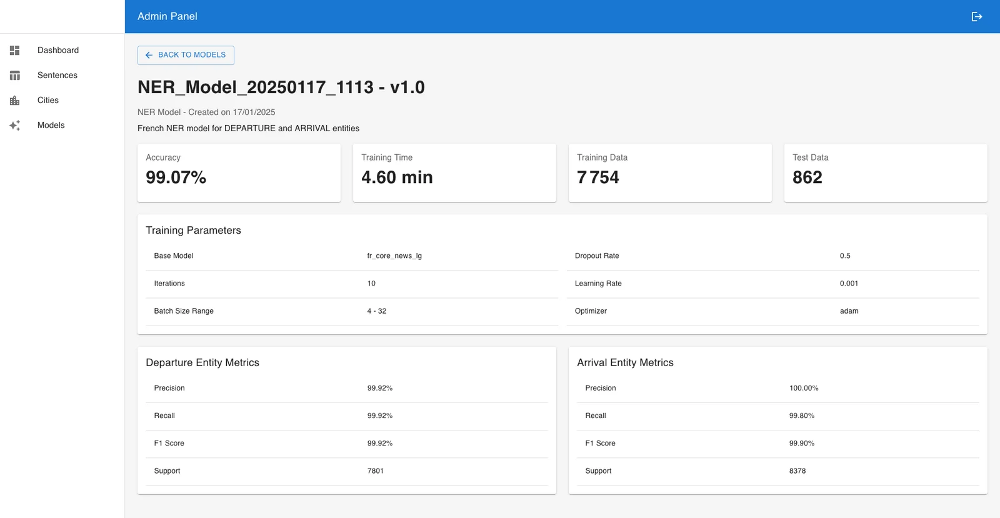

# 🧭 TrainQuest – Travel Order Resolver

## 📝 Présentation du projet

**TrainQuest** est une application web intelligente permettant à un utilisateur de formuler une demande de voyage en français, par texte ou micro, pour obtenir en retour un ou plusieurs trajets optimisés entre deux villes françaises.  
Ce projet repose sur des modèles NLP spécialisés (NLU/NER/Whisper), une architecture microservices dockerisée et une logique de graphe (algorithme de Dijkstra).

Projet réalisé en **équipe de 4 personnes**, dans le cadre d’un module d’intelligence artificielle et microservices.

---

## ⚙️ Fonctionnalités

- 🧠 **Analyse du langage naturel** : détection d’intention (NLU) et des entités villes (NER)
- 🎙️ **Reconnaissance vocale** : via Whisper (modèle Hugging Face)
- 🗺️ **Calcul d’itinéraires optimisés** via Dijkstra (graphe ferroviaire)
- 🌐 **Interface utilisateur** claire avec résultats visuels et cartographiques
- ⚙️ **Admin Panel** complet : suivi des modèles, données, phrases et entités

---

## 🧱 Architecture technique

- **Frontend** : React + Vite.js
- **Backend** :
  - `back` : service central Flask
  - `nlu`, `ner`, `whisper` : microservices IA Flask
- **Algorithme** : Dijkstra sur graphe SNCF
- **Database** : PostgreSQL
- **Reverse Proxy** : NGINX
- **Supervision** : Portainer (containers), Adminer (base de données)

---

## 🧪 Panel d’administration

Accessible aux développeurs ou data annotators :
- 🔍 **Monitoring des modèles** : version, date, précision, temps d’entraînement, dataset utilisé
- 🧮 **Statistiques globales** :
  - Total de phrases traitées / non traitées
  - Validées / invalidées
- ✍️ **Correction de phrases** :
  - Modification des entités reconnues (départ / arrivée)
  - Marquage de traitement (treated / untreated)
- 🗃️ **Gestion des villes** pour le graphe ferroviaire
- 📊 **Visualisation des scores** : F1, précision, rappel pour NER et NLU

---

## 🚀 Setup et déploiement

### 1. Cloner le dépôt
```bash
git clone https://github.com/votre-utilisateur/trainquest.git
cd trainquest
```

### 2. Configuration (optionnelle)
Créer un fichier `.env` si nécessaire pour personnaliser les paramètres (port, DB, etc.).

### 3. Décommenter les services de training (si besoin)
Dans `docker-compose.yml`, décommenter les services suivants pour réentraîner :
- `nlu-trainer`
- `ner-trainer`
- `create-dataset`

### 4. Lancer l’application
```bash
docker compose up --build
```
Accès via `http://localhost`

---

## 🖼️ Aperçus de l’application

- Écran d’accueil avec champ de requête vocale ou textuelle  
- Résultats de l’analyse NLU/NER  
- Itinéraires proposés et visualisation cartographique  
- Interface Admin : validation de phrases, édition d’entités, suivi de modèles















---

## 🧰 Stack technique

- Python (Flask, NLU, NER, Whisper)
- React, Vite.js
- PostgreSQL, Adminer
- Docker, Docker Compose, Portainer
- NGINX
- API REST + JSON