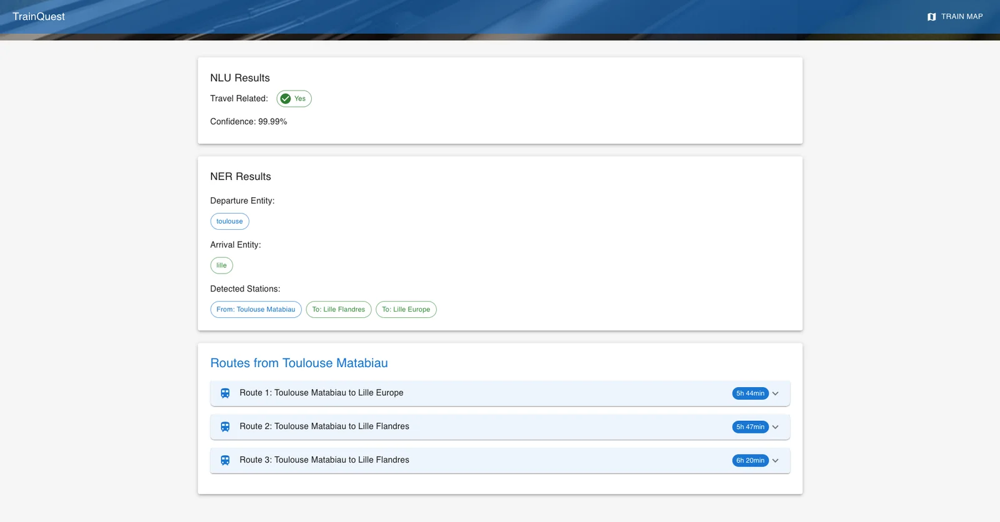
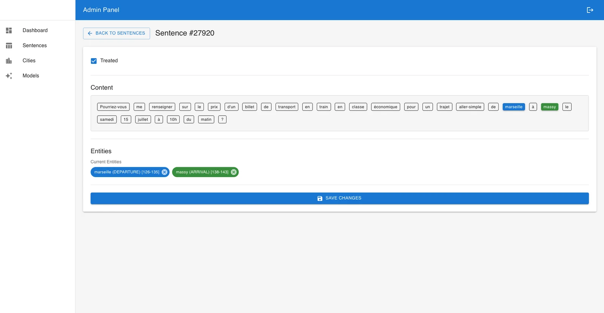

# 🧭 TrainQuest – Travel Order Resolver

---

## 🖼️ Application Previews

- Home screen with vocal or textual request field  
- NLU/NER analysis results  
- Proposed routes and cartographic visualization  
- Admin Interface : phrase validation, entity editing, model tracking








## 📝 Project Presentation

**TrainQuest** is a smart web application that allows a user to formulate a travel request in French, by text or voice, to obtain one or more optimized routes between two French cities in return.  
This project is based on specialized NLP models (NLU/NER/Whisper), a dockerized microservices architecture, and a graph logic (Dijkstra algorithm).

Project completed by a **team of 4 people**, as part of an artificial intelligence and microservices module.

---

## ⚙️ Features

- 🧠 **Natural Language Analysis** : intention detection (NLU) and city entities (NER)
- 🎙️ **Speech Recognition** : via Whisper (Hugging Face model)
- 🗺️ **Optimized Route Calculation** via Dijkstra (railway graph)
- 🌐 **User Interface** clear with visual and cartographic results
- ⚙️ **Admin Panel** complete : model tracking, data, phrases, and entities

---

## 🧱 Technical Architecture

- **Frontend** : React + Vite.js
- **Backend** :
  - `back` : central Flask service
  - `nlu`, `ner`, `whisper` : IA Flask microservices
- **Algorithm** : Dijkstra on SNCF graph
- **Database** : PostgreSQL
- **Reverse Proxy** : NGINX
- **Supervision** : Portainer (containers), Adminer (database)

---

## 🧪 Administration Panel

Accessible to developers or data annotators :
- 🔍 **Model Monitoring** : version, date, accuracy, training time, dataset used
- 🧮 **Global Statistics** :
  - Total of processed / unprocessed sentences
  - Validated / invalidated
- ✍️ **Sentence Correction** :
  - Modification of recognized entities (departure / arrival)
  - Treatment marking (treated / untreated)
- 🗃️ **City Management** for the railway graph
- 📊 **Score Visualization** : F1, precision, recall for NER and NLU

---

## 🚀 Setup and Deployment

### 1. Configuration (optional)
Create a `.env` file to set parameters.

### 2. Uncomment training services (if needed)
In `docker-compose.yml`, uncomment the following services to retrain :
- `nlu-trainer`
- `ner-trainer`
- `create-dataset`

### 3. Launch the application
```bash
docker compose up --build
```
Access via `http://localhost`

---

## 🧰 Technical Stack

- Python (Flask, NLU, NER, Whisper)
- React, Vite.js
- PostgreSQL, Adminer
- Docker, Docker Compose, Portainer
- NGINX
- API REST + JSON
